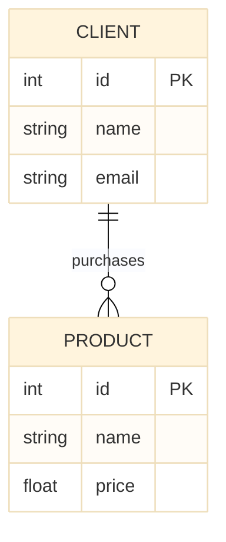
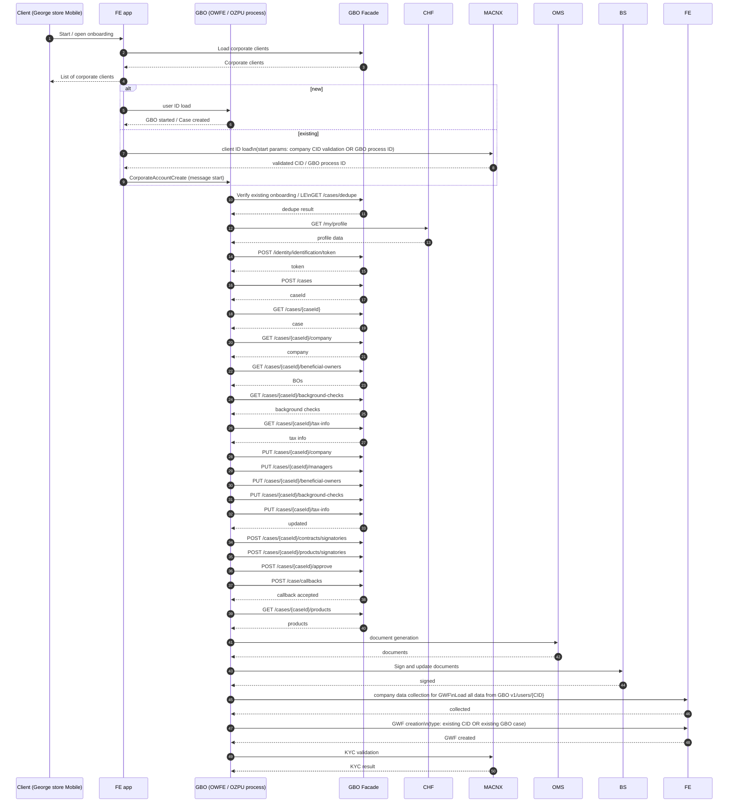

# Digitálna obsluha limitov pre elektronické kanály
sprava limitov pre elektronicke bankovnictvo


# 🧠 COMPONENT

```yaml
contact:
  name: Responsible Team
  email: Team's email alias
```

[[_TOC_]]

### 🎯 Purpose

## 🏗️ Architecture

### 🗄️ Data Model

<!-- TODO: Update example. -->



## 📜 API Commons

A shared set of standards or common guidelines applicable across various APIs or Features.

### 🔑 Authorization

### 🔢 Generic Sequence diagram



<!-- TODO: Any other component level details applicable for every supported feature. -->

## 📑 Related documentation

- 🔗 [**Component `COMP-XX`**](https://jira.app.slsp.sk/browse/)
- 🔐 [**List of scopes by specific API endpoint**](_assets/list_of_scopes.md)
