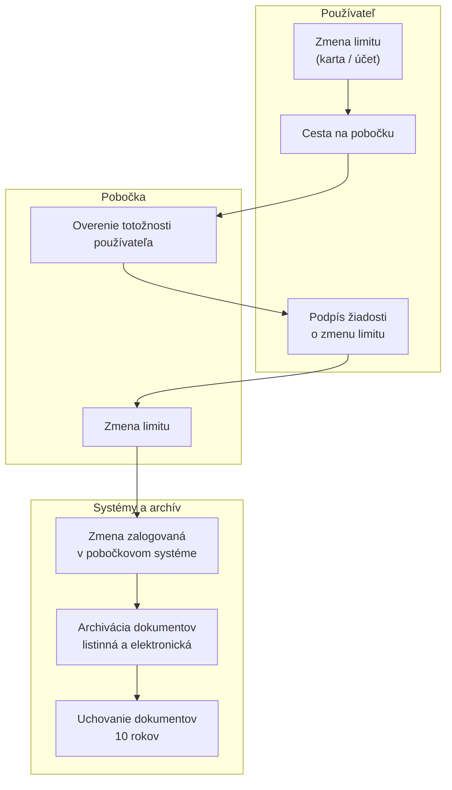
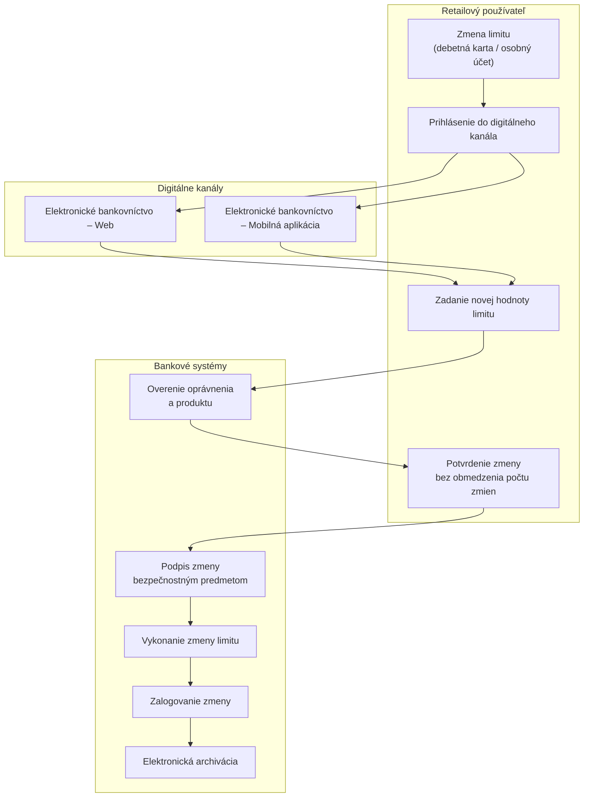
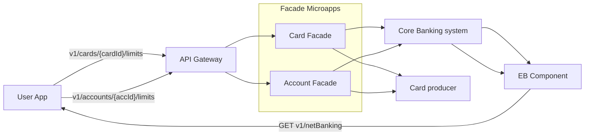
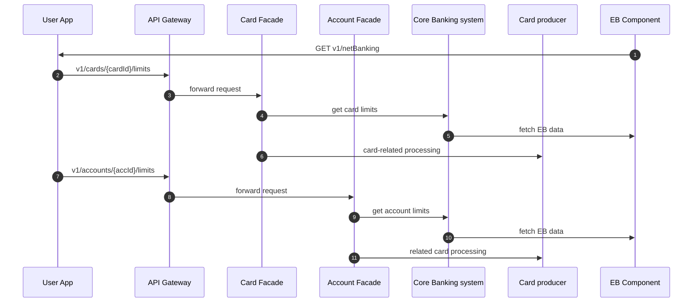

# Digitálna obsluha limitov pre elektronické kanály
Zmenová požiadavka

```yaml
contact:
  name: Responsible Team
  email: Team's email alias
```

[[_TOC_]]

## 🎯 Súčasný stav
Ak chce používateľ meniť limity na jednotlivých produktoch (karta, účet), je v súčasnej dobe nútený navštíviť najbližšiu pobočku. Operátor na pobočke je schopný používateľovi zmeniť limit podľa požiadavky po overení totožnoti a fyzickom podpísaní žiadosti o zmenu. Zmena je aktuálne logovaná v pobočkovom systéme a dokumenty sú archivované v listinnej aj elektronickej podobe v archívoch po dobu 10-tich rokov.

```mermaid
flowchart TD

    subgraph U[Používateľ]
        A["Zmena limitu<br/>(karta / účet)"]
        B[Cesta na pobočku]
        D[Podpís žiadosti<br/>o zmenu limitu]
    end

    subgraph O[Pobočka]
        C[Overenie totožnosti používateľa]
        E[Zmena limitu]
    end

    subgraph S[Systémy a archív]
        F[Zmena zalogovaná<br/>v pobočkovom systéme]
        G[Archivácia dokumentov<br/>listinná a elektronická]
        H[Uchovanie dokumentov<br/>10 rokov]
    end

    A --> B
    B --> C
    C --> D
    D --> E
    E --> F
    F --> G
    G --> H
```
## 🏗️ Cieľový stav
Cieľom je používateľovi ponúknuť digitálnu verziu procesu pre úpravu limitov na produktoch v rámci všetkých digitálnych kanálov. Služba bude dostupná 24/7 bez nutnosti fyzickej návševy banky. Zmena bude podpisovaná bezpečnostným predmetom a počet zmien nebude limitovaný.

V rámci tejto zmenovej požiadavky budú riešené produkty:

- debetná karta
- osobný účet

v kanáloch:

- elektronické bankovníctvo - web
- elektronické bankovníctvo - mobilná aplikácia

pre segment retailových klientov.

Pre obsluhu korporátnych klientov a zmeny limitov pre kreditné karty bude vytvorená samostatná zmenová požiadavka.


```mermaid

flowchart TD

    subgraph U[Retailový používateľ]
        A["Zmena limitu<br/>(debetná karta / osobný účet)"]
        B[Prihlásenie do digitálneho kanála]
        C[Zadanie novej hodnoty limitu]
        D[Potvrdenie zmeny<br/>bez obmedzenia počtu zmien]
    end

    subgraph K[Digitálne kanály]
        K1[Elektronické bankovníctvo – Web]
        K2[Elektronické bankovníctvo – Mobilná aplikácia]
    end

    subgraph S[Bankové systémy]
        E[Overenie oprávnenia<br/>a produktu]
        F[Podpis zmeny<br/>bezpečnostným predmetom]
        G[Vykonanie zmeny limitu]
        H[Zalogovanie zmeny]
        I[Elektronická archivácia]
    end

    A --> B
    B --> K1
    B --> K2
    K1 --> C
    K2 --> C
    C --> E
    E --> D
    D --> F
    F --> G
    G --> H
    H --> I

```

## 🗄️ Detailný popis požiadavky
A. Entry points
   1. mobilná aplikácia
    
    - Debetná karta
        
        Používateľ v súčasnosti vidí na overview page zoznam kariet aj s limitmi. Nemôže ich však meniť. Pre túto potrebu bude pripravená sub-page kde používateľ uvidí 4 kategórie limitov, ktoré bude možné upravovať. Používateľ sa na ňu dostáva cez tlačidlo 'Zmena limitov' v detaile karty.
   
    - Účet
        Používateľ po prihlásení vidí zoznam účtov. Po kliknutí na prehľad účtu sa dostáva na detail účtu, kde pribudne tlačidlo 'Zmena denného limitu'.


   2. web
      1. Debetná karta
        Používateľ po prihlásení vidí zoznam platobných kariet. Po kliknutí na ikonu karty sa dostáva na detail karty, kde pribudne tlačidlo 'Zmena limitov'.
      2. Účet
        Používateľ si dokáže upraviť limity v detaile účtu, po kliknutí na tlačidlo 'Zmena denného limitu'
    Všetky entry pointy budú sprístupnené bez nutnosti aktivácie. Právo na úpravu limitov bude mať len vlastník účtu.

B. Typy limitov

       1. Debetná karta
        Pri debetnej karte bude možné spravovať 4 druhy limitov a to:
        - maximálny jednorázový objem pre výber z bankomatu
        - maximálna jednorazovo uhradená suma cez platobný terminál (PoS)
        - maximálna jednorázová platba cez platobnú branu a platobné metódy tretích strán (Gpay, ApplePay atd...)
        - denný limit pre celkový obrat na karte (suma všetkých )

       2. Účet
        Na osobnom účte bud možné nastavovať 1 limit - denný maximálny obrat na účte definovaný ako súčet všetkých debetných operácií v čase 0-24. 

C. Autorizácia
        Každá úprava limitu musí byť autorizovaná samostatne. Autorizácia prebieha v elektronickom kanále a používateľ si môže vybrať jeden zo svojich aktívnych bezpečnostných predmetov. 

## 🏗️ Architektúra



```mermaid
graph LR
    UserApp["User App"]
    APIGW["API Gateway"]
    coreBanking["Core Banking system"]
    CardProducer["Card producer"]

    subgraph Facades["Facade Microapps"]
        CardFacade["Card Facade"]
        AccountFacade["Account Facade"]
    end

    EB["EB Component"]

     EB -->|"GET v1/netBanking"| UserApp
    

    UserApp -->|"v1/cards/{cardId}/limits"| APIGW
    APIGW --> CardFacade
    coreBanking --> EB
    CardFacade --> coreBanking
    CardFacade --> CardProducer

    UserApp -->|"v1/accounts/{accId}/limits"| APIGW
    APIGW --> AccountFacade
    coreBanking --> EB
    AccountFacade --> coreBanking
    AccountFacade --> CardProducer

   
```


| Typ zmeny | Metóda | Endpoint | Detail úpravy |
|----------|--------|----------|---------------|
| Úprava | GET | v1/netBanking | Úprava existujúceho endpointu – pridanie informácií o vzťahu prihláseného používateľa ku karte/účtu  |
| Nová | POST | v1/cards/{cardId}/limits | Nový endpoint na nastavenie alebo zmenu limitov pre konkrétnu kartu |
| Nová | POST | v1/accounts/{accId}/limits | Nový endpoint na nastavenie alebo zmenu limitov pre konkrétny účet |


## 📜 API Commons

A shared set of standards or common guidelines applicable across various APIs or Features.

### 🔑 Authorization

### 🔢 Generic Sequence diagram


```mermaid

sequenceDiagram
    autonumber

    participant UserApp as User App
    participant APIGW as API Gateway
    participant CardFacade as Card Facade
    participant AccountFacade as Account Facade
    participant CoreBanking as Core Banking system
    participant CardProducer as Card producer
    participant EB as EB Component

    %% Net banking initialization
    EB ->> UserApp: GET v1/netBanking

    %% Card limits flow
    UserApp ->> APIGW: v1/cards/{cardId}/limits
    APIGW ->> CardFacade: forward request
    CardFacade ->> CoreBanking: get card limits
    CoreBanking ->> EB: fetch EB data
    CardFacade ->> CardProducer: card-related processing

    %% Account limits flow
    UserApp ->> APIGW: v1/accounts/{accId}/limits
    APIGW ->> AccountFacade: forward request
    AccountFacade ->> CoreBanking: get account limits
    CoreBanking ->> EB: fetch EB data
    AccountFacade ->> CardProducer: related card processing

```

<!-- TODO: Any other component level details applicable for every supported feature. -->

## 📑 Related documentation

- 🔗 [**Component `COMP-XX`**](https://jira.app.slsp.sk/browse/)
- 🔐 [**List of scopes by specific API endpoint**](_assets/list_of_scopes.md)
