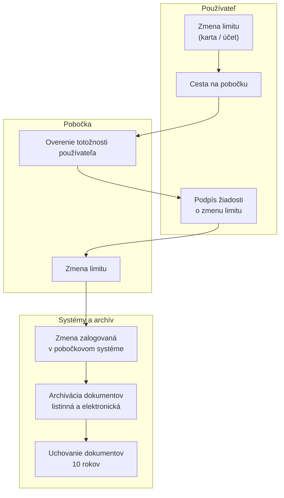
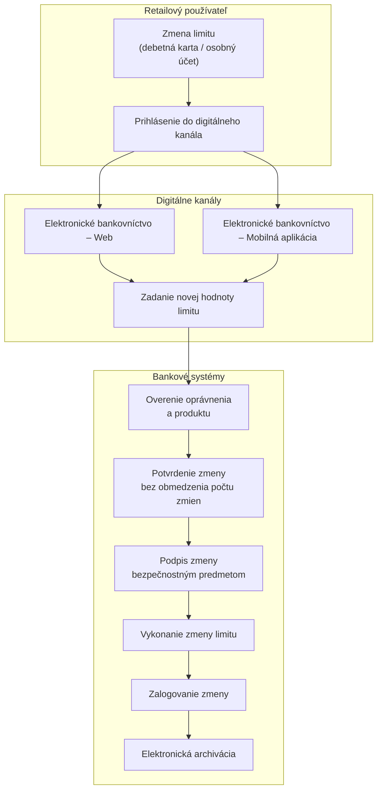
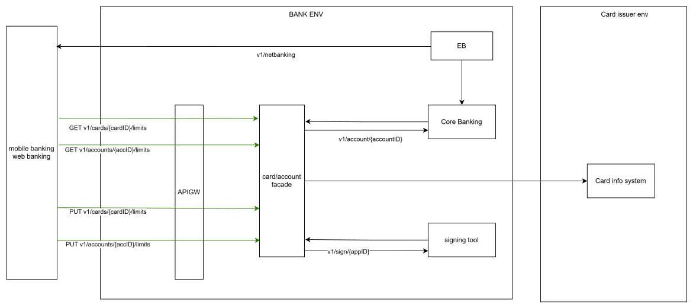
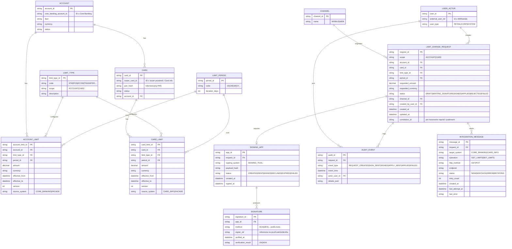

# Digitálna obsluha limitov pre elektronické kanály
Zmenová požiadavka

```yaml
contact:
  name: Daily banking
  email: dailyBanking@smileBank.com
```

[[_TOC_]]

## 🎯 Súčasný stav
Ak chce používateľ meniť limity na jednotlivých produktoch (karta, účet), je v súčasnej dobe nútený navštíviť najbližšiu pobočku. Operátor na pobočke je schopný používateľovi zmeniť limit podľa požiadavky po overení totožnoti a fyzickom podpísaní žiadosti o zmenu. Zmena je aktuálne logovaná v pobočkovom systéme a dokumenty sú archivované v listinnej aj elektronickej podobe v archívoch po dobu 10-tich rokov.

```mermaid
flowchart TD

    subgraph U[Používateľ]
        A["Zmena limitu<br/>(karta / účet)"]
        B[Cesta na pobočku]
        D[Podpís žiadosti<br/>o zmenu limitu]
    end

    subgraph O[Pobočka]
        C[Overenie totožnosti používateľa]
        E[Zmena limitu]
    end

    subgraph S[Systémy a archív]
        F[Zmena zalogovaná<br/>v pobočkovom systéme]
        G[Archivácia dokumentov<br/>listinná a elektronická]
        H[Uchovanie dokumentov<br/>10 rokov]
    end

    A --> B
    B --> C
    C --> D
    D --> E
    E --> F
    F --> G
    G --> H
```
## 🏗️ Cieľový stav
Cieľom je používateľovi ponúknuť digitálnu verziu procesu pre úpravu limitov na produktoch v rámci všetkých digitálnych kanálov. Služba bude dostupná 24/7 bez nutnosti fyzickej návševy banky. Zmena bude podpisovaná bezpečnostným predmetom a počet zmien nebude limitovaný. 

Týmto riešením budú odstránené hlavné užívateľské problémy - nutnosť návštevy pobočky, fyzické podpisovanie dokumentov, nedostupnosť služby mimo pracovných hodín, neflexibilné manažovanie limitov.

Z pohľadu banky sa odstráni potreba archivácie dokumentov, zníži sa početnosť návštev na pobočke a dobehne sa konkurencia, ktorá už touto funkcionalitou disponuje dlhší čas.

V rámci tejto zmenovej požiadavky budú riešené produkty:

- debetná karta
- osobný účet

v kanáloch:

- elektronické bankovníctvo - web
- elektronické bankovníctvo - mobilná aplikácia

pre segment retailových klientov.

Pre obsluhu korporátnych klientov a zmeny limitov pre kreditné karty bude vytvorená samostatná zmenová požiadavka.
V každom procese pôjde o úpravu limitov, nakoľko pri zakladaní produktu sa vždy limity definujú.



```mermaid

flowchart TD

    subgraph U[Retailový používateľ]
        A["Zmena limitu<br/>(debetná karta / osobný účet)"]
        B[Prihlásenie do digitálneho kanála]
        
        
    end

    subgraph K[Digitálne kanály]
        K1[Elektronické bankovníctvo – Web]
        C[Zadanie novej hodnoty limitu]
        K2[Elektronické bankovníctvo – Mobilná aplikácia]
    end

    subgraph S[Bankové systémy]
        E[Overenie oprávnenia<br/>a produktu]
        D[Potvrdenie zmeny<br/>bez obmedzenia počtu zmien]
        F[Podpis zmeny<br/>bezpečnostným predmetom]
        G[Vykonanie zmeny limitu]
        H[Zalogovanie zmeny]
        I[Elektronická archivácia]
    end

    A --> B
    B --> K1
    B --> K2
    K1 --> C
    K2 --> C
    C --> E
    E --> D
    D --> F
    F --> G
    G --> H
    H --> I

```

## 🗄️ Detailný popis požiadavky
A. Entry points
1. mobilná aplikácia
    
- Debetná karta
        
    Používateľ v súčasnosti vidí na overview page zoznam kariet aj s limitmi. Nemôže ich však meniť. Pre túto potrebu bude pripravená sub-page kde používateľ uvidí 4 kategórie limitov, ktoré bude možné upravovať. Používateľ sa na ňu dostáva cez tlačidlo 'Zmena limitov' v detaile karty.
   
- Účet
    
    Používateľ po prihlásení vidí zoznam účtov. Po kliknutí na prehľad účtu sa dostáva na detail účtu, kde pribudne tlačidlo 'Zmena denného limitu'.
    
2. web
      
- Debetná karta
        Používateľ po prihlásení vidí zoznam platobných kariet. Po kliknutí na ikonu karty sa dostáva na detail karty, kde pribudne tlačidlo 'Zmena limitov'.
- Účet
        Používateľ si dokáže upraviť limity v detaile účtu, po kliknutí na tlačidlo 'Zmena denného limitu'
    Všetky entry pointy budú sprístupnené bez nutnosti aktivácie. Právo na úpravu limitov bude mať len vlastník účtu.

B. Typy limitov

1. Debetná karta
        
    Pri debetnej karte bude možné spravovať 4 druhy limitov a to:
- maximálny jednorázový objem pre výber z bankomatu
- maximálna jednorazovo uhradená suma cez platobný terminál (PoS)
- maximálna jednorázová platba cez platobnú branu a platobné metódy tretích strán (Gpay, ApplePay atd...)
- denný limit pre celkový obrat na karte (suma všetkých )

2. Účet

    Na osobnom účte bud možné nastavovať 1 limit - denný maximálny obrat na účte definovaný ako súčet všetkých debetných operácií v čase 0-24. 

    Pravidlá pre hodnoty limitov:

- denný limit musí byť rovný alebo väčší ako súčet všetkých ďalších limitov
- každý limit je celé číslo bez desatinných miest
- limit sa nenulový
- limit nemôže prekročiť hodnoty nastavené pre jedotlivé produkty
- zmena limitu je platná bezodkladne po potrdení zmeny v kanále

C. Autorizácia
    
 Každá úprava limitu musí byť autorizovaná samostatne. Autorizácia prebieha v 
    elektronickom kanále a používateľ si môže vybrať jeden zo svojich aktívnych bezpečnostných predmetov. 

D. Oznámenie o zmene

Po zápise novej hodnoty limitu je o zmene notifikovaný vlastník produktu prostredníctvom push notifikácie cez nainštalovanú mobilnú aplikáciu.

Zároveň je zmena logovaná do užívateľského profilu tak, aby bola zmena viditeľná aj pre kontaktné centrum a operátora na pobočke.


## 🏗️ Architektúra
Pre navrhované riešenie sa počíta s existenciou integrácie na úpravu limitov na komponentoch Core banking a vydávateľa karty, nakoľko sa limity v súčasnej dobe dajú upravovať na pobočke.

Na integráciu medzi používateľskou aplikáciou a bankovými systémami sú uz existujúce fasádne mikroaplikácie, ktoré na základe volania vykonajú biznis logiku.

Po prevolaní endpointu sa v prvom kroku vyvolá podpisová obrazovka a po úspešnom podpísaní žiadosi sa zmena zanáša cez už dostupné endpointy do core bankových systémov a do systému vydávateľa karty.



Source: [EB limits for accounts and cards](assets/limits.svg)


| Typ zmeny | Metóda | Endpoint | Detail úpravy |
|----------|--------|----------|---------------|
| Úprava | GET | v1/netBanking | Úprava existujúceho endpointu – pridanie informácií o vzťahu prihláseného používateľa ku karte/účtu.  |
| Nová | PUT | v1/cards/{cardId}/limits | Nový endpoint na nastavenie alebo zmenu limitov pre konkrétnu kartu |
| Nová | PUT | v1/accounts/{accId}/limits | Nový endpoint na nastavenie alebo zmenu limitov pre konkrétny účet |
| Nová | GET | v1/cards/{cardId}/limits | Nový endpoint na načítanie zoznamu limitov pre konkrétnu kartu |
| Nová | GET | v1/accounts/{accId}/limits | Nový endpoint na načítanie zoznamu limitov pre konkrétny účet |

| Dopadový komponent | Popis dopadu |
|-------------------|--------------|
| Electronic Banking          | Rozšírenie o feature flag číselníkové hodnotu, ktorá definuje monžnosť úpravy limitu pre daný produkt v rámci služby GET v1/netBanking. Zdrojom informácií bude Core banking system. |
| Core banking      | Povolenie úpravy limitu pre produkty debetná karta a účet z kanálu elektronického bankovníctva. |
| API GW            | Úprava swaggru pre nové služby. |
| Daily banking            | Vývoj 4 nových endpointov pre načítanie a úpravu limitov pre karty a účty.|
| CRM            | Príprava kampane pre používateľov|


### 🔢 Stavový diagram
```mermaid
stateDiagram-v2
    [*] --> Neprihlaseny

    state "Retailový používateľ" as RU {
        Neprihlaseny --> Prihlaseny : prihlásenie
        Prihlaseny --> VyberKanala : vstup do digitálneho kanála

    }

    state "Digitálne kanály" as DK {
        state VyberKanala <<choice>>
        Web
        Mobil
        ZadanieZmeny
    }

    %% výber kanála až po prihlásení
    VyberKanala --> Web : Elektronické bankovníctvo – Web
    VyberKanala --> Mobil : Elektronické bankovníctvo – Mobilná aplikácia

    Web --> ZadanieZmeny
    Mobil --> ZadanieZmeny

    state "Bankové systémy" as BS {
        Overenie : Overenie oprávnenia
        Podpis : Podpis zmeny bezpečnostným predmetom
        Zmena : Vykonanie zmeny limitu
        Log : Zalogovanie zmeny
        Archiv : Elektronická archivácia

        state RozhodnutieOpravnenia <<choice>>
        state RozhodnutiePodpisu <<choice>>

        Overenie --> RozhodnutieOpravnenia
        RozhodnutieOpravnenia --> Podpis : OK
        RozhodnutieOpravnenia --> Zamietnute : Neoprávnené / neplatný produkt

        Podpis --> RozhodnutiePodpisu
        RozhodnutiePodpisu --> Zmena : Podpis OK
        RozhodnutiePodpisu --> Zamietnute : Podpis zlyhal / zrušené

        Zmena --> Log
        Log --> Archiv
        Archiv --> Uspesne
    }

    ZadanieZmeny --> Overenie : požiadavka na zmenu limitu
    Uspesne --> [*]
    Zamietnute --> [*]
  ```
   
  
### 🔢 Seknvenčný diagram

```mermaid

sequenceDiagram
    autonumber

    participant UserApp as User App
    participant APIGW as API Gateway
    participant CardFacade as Card Facade
    participant AccountFacade as Account Facade
    participant CoreBanking as Core Banking system
    participant CardProducer as Card producer
    participant EB as EB Component

    %% Net banking initialization
    EB ->> UserApp: GET v1/netBanking

    %% Card limits flow (PUT)
    UserApp ->> APIGW: GET v1/cards/{cardId}/limits
    APIGW ->> CardFacade: forward request
    CardFacade ->> CoreBanking: load card limits
    CoreBanking ->> UserApp: list of all card limits
    UserApp ->> APIGW: PUT v1/cards/{cardId}/limits
    APIGW ->> CardFacade: forward request
    CardFacade ->> CoreBanking: process card limits
    EB ->> CoreBanking: fetch EB data
    CardFacade ->> CardProducer: card-related processing

    %% Account limits flow (PUT)
    UserApp ->> APIGW: GET v1/accounts/{accId}/limits
    APIGW ->> CardFacade: forward request
    CardFacade ->> CoreBanking: load account limits
    CoreBanking ->> UserApp: list of all account limits
    UserApp ->> APIGW: PUT v1/accounts/{accId}/limits
    APIGW ->> AccountFacade: forward request
    AccountFacade ->> CoreBanking: process account limits
    EB->> CoreBanking: fetch EB data
    AccountFacade ->> CardProducer: related account processing
```
### 🔢 Databázový model


```mermaid
erDiagram

    CHANNEL {
        string channel_id PK
        string name              "MOBILE|WEB"
    }

    USER_ACTOR {
        string user_id PK
        string external_user_ref "id z IAM/kanála"
        string user_type         "RETAIL|CORP|SYSTEM"
    }

    ACCOUNT {
        string account_id PK
        string core_banking_account_id "ID v Core Banking"
        string iban
        string currency
        string status
    }

    CARD {
        string card_id PK
        string issuer_card_id     "ID v issuer prostredí / Card info"
        string pan_hash           "tokenizovany PAN"
        string status
        string account_id FK
    }

    LIMIT_TYPE {
        string limit_type_id PK
        string code              "ATM|POS|ECOM|TRANSFER..."
        string scope             "ACCOUNT|CARD"
        string description
    }

    LIMIT_PERIOD {
        string period_id PK
        string code              "1D|1W|1M|1Y..."
        int    duration_days
    }

    %% Aktuálne (effective) limity
    ACCOUNT_LIMIT {
        string account_limit_id PK
        string account_id FK
        string limit_type_id FK
        string period_id FK
        decimal amount
        string currency
        datetime effective_from
        datetime effective_to
        int version
        string source_system     "CORE_BANKING|FACADE"
    }

    CARD_LIMIT {
        string card_limit_id PK
        string card_id FK
        string limit_type_id FK
        string period_id FK
        decimal amount
        string currency
        datetime effective_from
        datetime effective_to
        int version
        string source_system     "CARD_INFO|FACADE"
    }

    %% Žiadosť o zmenu limitu (PUT)
    LIMIT_CHANGE_REQUEST {
        string request_id PK
        string scope              "ACCOUNT|CARD"
        string account_id FK
        string card_id FK
        string limit_type_id FK
        string period_id FK
        decimal requested_amount
        string requested_currency
        string status             "DRAFT|WAITING_SIGNATURE|SIGNED|APPLIED|REJECTED|FAILED"
        string channel_id FK
        string created_by_user_id FK
        datetime created_at
        datetime updated_at
        string correlation_id     "pre trasovanie naprieč systémami"
    }

    %% Podpisovanie
    SIGNING_APP {
        string app_id PK
        string request_id FK
        string signing_system     "SIGNING_TOOL"
        string payload_hash
        string status             "CREATED|SENT|SIGNED|DECLINED|EXPIRED|FAILED"
        datetime created_at
        datetime signed_at
    }

    SIGNATURE {
        string signature_id PK
        string app_id FK
        string method             "SCA|QES|... podľa toolu"
        string signer_ref         "referencia na používateľa/identitu"
        datetime verified_at
        string verification_result "OK|NOK"
    }

    %% Audit a udalosti (čo sa stalo, kedy a prečo)
    AUDIT_EVENT {
        string audit_id PK
        string request_id FK
        string event_type         "REQUEST_CREATED|SIGN_SENT|SIGNED|APPLY_SENT|APPLIED|FAILED..."
        datetime event_time
        string actor_user_id FK
        string details_json
    }

    %% Outbox/log pre integrácie (Core Banking / Card info)
    INTEGRATION_MESSAGE {
        string message_id PK
        string request_id FK
        string target_system      "CORE_BANKING|CARD_INFO"
        string operation          "GET_LIMITS|SET_LIMITS"
        string http_method        "GET|PUT"
        string endpoint
        string status             "NEW|SENT|ACK|ERROR|RETRYING"
        int retry_count
        datetime created_at
        datetime last_attempt_at
        string last_error
    }

    %% Vzťahy
    CHANNEL ||--o{ LIMIT_CHANGE_REQUEST : originates
    USER_ACTOR ||--o{ LIMIT_CHANGE_REQUEST : creates
    USER_ACTOR ||--o{ AUDIT_EVENT : acts

    ACCOUNT ||--o{ CARD : has
    ACCOUNT ||--o{ ACCOUNT_LIMIT : has
    CARD ||--o{ CARD_LIMIT : has

    LIMIT_TYPE ||--o{ ACCOUNT_LIMIT : configures
    LIMIT_PERIOD ||--o{ ACCOUNT_LIMIT : over
    LIMIT_TYPE ||--o{ CARD_LIMIT : configures
    LIMIT_PERIOD ||--o{ CARD_LIMIT : over

    LIMIT_CHANGE_REQUEST ||--o{ AUDIT_EVENT : logs
    LIMIT_CHANGE_REQUEST ||--o| SIGNING_APP : requires
    SIGNING_APP ||--o{ SIGNATURE : produces

    LIMIT_CHANGE_REQUEST ||--o{ INTEGRATION_MESSAGE : sends

```
<!-- TODO: Any other component level details applicable for every supported feature. -->
## 📜 API Commons

Spoločný súbor štandardov alebo pravidiel používaných v API.

### 🔑 Autorizácia

API nezodpovedá za autentifikáciu (t. j. overenie, či je používateľ/klient tým, za koho sa vydáva, napr. kontrolou mena a hesla), ale výhradne za autorizáciu (t. j. overenie, či môže používateľ/klient pristupovať ku konkrétnemu zdroju v danom čase).

API je teda založené na tokenovom bezpečnostnom koncepte a potrebuje iba overiť platnosť tokenov, ktoré klient pri každom volaní poskytuje ako dôkaz, že má oprávnenie pristupovať k požadovaným dátam.

Práca s tokenom

Z pohľadu tohto API je token „blackbox“, ktorá je súčasťou každej klientskej požiadavky:

Prijatý token odovzdá serverovej knižnici alebo službe na overenie.
Ak sa ukáže, že token je platný pre konkrétne volanie, vykoná sa biznis logika.
API nemusí token samo parsovať ani interpretovať.

Požiadavky na token

Toto API môže pracovať s akýmkoľvek typom tokenu, pokiaľ platia nasledujúce predpoklady:

- token je už vo formáte/kódovaní, ktoré je možné odovzdať v HTTP hlavičke Authorization

- maximálna veľkosť tokenu je 1024 bajtov
(keďže sa posiela s každou požiadavkou a pri mobilných zariadeniach záleží na každej milisekunde; priemerná veľkosť by však mala byť výrazne menšia, napr. ~256 bajtov, kvôli zníženiu prenosu dát)

- platnosť tokenu je možné overiť pomocou knižnice alebo služby

- z tokenu je možné odvodiť používateľa

- z tokenu je možné odvodiť oprávnenia, vrátane:

samostatných oprávnení na čítanie a zápis oprávnení až na úroveň konkrétneho biznis objektu (napr. konkrétny účet, správa alebo šablóna)
alternatívne môže token definovať oprávnenia vo väčších celkoch, najmä pri entitách, ktoré používateľ vlastní, napr. „všetky moje účty“

**Použitá technológia**

Použije sa OAuth 2.0 bearer token.
